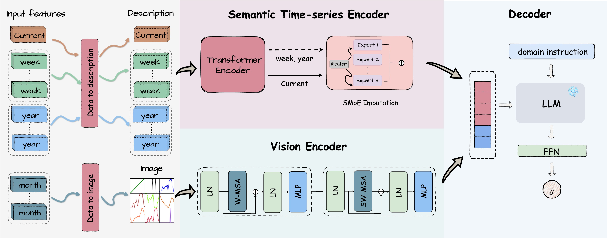

# :bulb: LITE: Modeling Environmental Ecosystems with Multimodal Large Language Models

 [](https://arxiv.org/abs/2404.01165)

This is the official pytorch implementation of LITE: Modeling Environmental Ecosystems with Multimodal Large Language Models <a href="https://arxiv.org/abs/2404.01165" style="text-decoration:none;">[paper]</a>.

<p align="center">
 
</p>


## :clipboard: To Do
 - [x] upload pre-processing scripts
 - [x] upload model
 - [ ] upload training scripts

## :memo: Requirements
1. Clone this repository and navigate to LITE folder.
```
git clone https://github.com/hrlics/LITE.git
cd LITE
```
2. Install packages.
```
conda create -n LITE python=3.10 -y
conda activate LITE
pip install -r requirements.txt
```


## 📦 Preparation
1. Save the environmental data in the format of Hugging Face Datasets. Suppose it is tabular data, with N features and 1 target variable.
2. Construct temporal trend images.
```
python draw_temporal_image.py \
 --feature_path path/to/your/raw/features \
 --target_path path/to/your/raw/targets \
 --dataset_path path/to/the/huggingface_datasets \
 --dataset_name name/of/the_parent_dir/of/huggingface_datasets  \
 --len_look_back look_back_window_size (default:30)
```

## 🚀 Training
1. The training code is at ```./train.py```.
2. The relevant script can be found at ```scripts/train_{dataset_name}.sh```.
```
sh ./scripts/train_{dataset_name}.sh
```

## 📚 Citation
```
@article{li2024lite,
  title={LITE: Modeling Environmental Ecosystems with Multimodal Large Language Models},
  author={Li, Haoran and Liu, Junqi and Wang, Zexian and Luo, Shiyuan and Jia, Xiaowei and Yao, Huaxiu},
  journal={arXiv preprint arXiv:2404.01165},
  year={2024}
}
```
